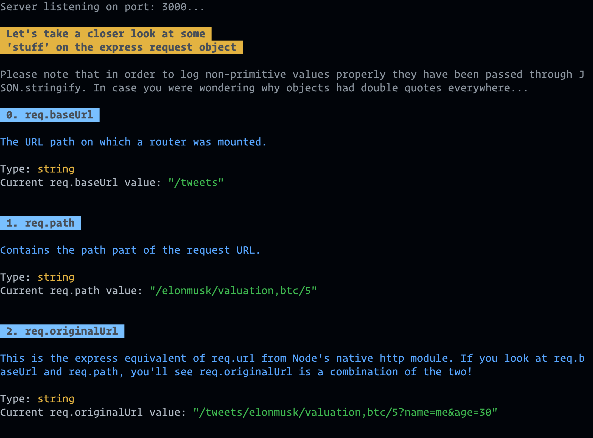
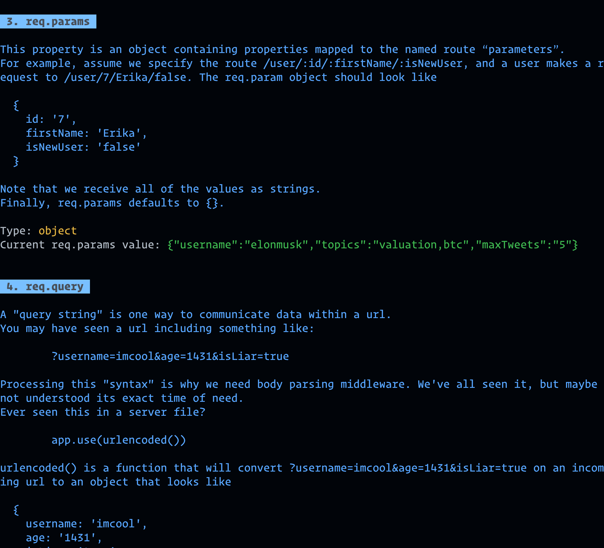

# Logging Express

## What is it?

- custom node/express logging middleware
- intended as a debugger and learning aid
- newcomers to node/express might enjoy it most

## Installation

> It's scoped to my npm account, hence the `@notthedom` in the install command

```shell
npm install --save-dev @notthedom/logging-express
```

- exposes a default export function. See `src/main.ts`
  - Note you can name default exports whatever you want when you import them
- you probably want it as a dev dependency

## Getting started

### Import/require

> works with esmodules and commonjs

```javascript
// all good
import myShinyLogger from '@notthedom/logging-express';

// also works
const mySpecialLogger = require('@notthedom/logging-express');
```

### Usage

> Mount as middleware on express server (various ways of doing this of course)

#### Example

```javascript
// The usual...
import express from 'express';
import myLogger from '@notthedom/logging-express';

const app = express();
app.use(express.urlencoded({ extended: true }));

/**
 * Here we go!
 * Pass myLogger as second argument to route handler
 * Don't worry it calls next() for you :)
 */
app.get('/*', myLogger, (_req, res) => {
  res.send({ message: 'Fingers crossed we get some nice logs' });
});
```

## Features

- For every request, it logs a human-friendly report for properties on express' request object

- Current properties reported on

  - baseUrl
  - path
  - originalUrl
  - params
  - query
  - see `src/data.ts` for details

- For each property, the report includes

  - property name e.g. `req.path`
  - description
  - JS type of the property's value
  - the current property value itself

> I had the newcomer in mind, so some descriptions are verbose.
> Watch this space for config options.

## Screenshots




## Links

- Project repository: https://github.com/dominicvana/logging-express

- Issue tracker: https://github.com/dominicvana/logging-express/issues

## Licensing

This project is licensed under MIT license.

---

## **End of "proper" readme content**

---

> Keep reading for some learning philosophising...

### Hypothesis

> For non-CS people, entering node-land is a bewildering step in the JS learning journey.
>
> Is learning node/express tougher than it could be?

Worth noting I'm 2 years into my own coding journey. By no means a pro, but I have noticed a change in how I approach learning new things.

> When I don't understand something, I **immediately inspect it in as much detail as I can**.

#### Some tactics

- console.log everything I don't know the type or value of

- dive deep into nested data structures

- look into every corner of the `__proto__`/`[[Prototype]]` chain... _"So that's why I can access `res.json()`!"_

- read docs and (with caution) stack overflow posts

#### The beginner's dilemma

Unless you're quite experienced, those tactics are

1. cognitively taxing

2. time consuming

3. confidence destroying for many of us

> In that spirit, this project's purpose is to help you free up some brain space while you learn something new and difficult.
>
> Your potential is too valuable to spend hours typing `console.log`.
>
> Reserve your efforts for the big stuff: **learning** and **building**.
